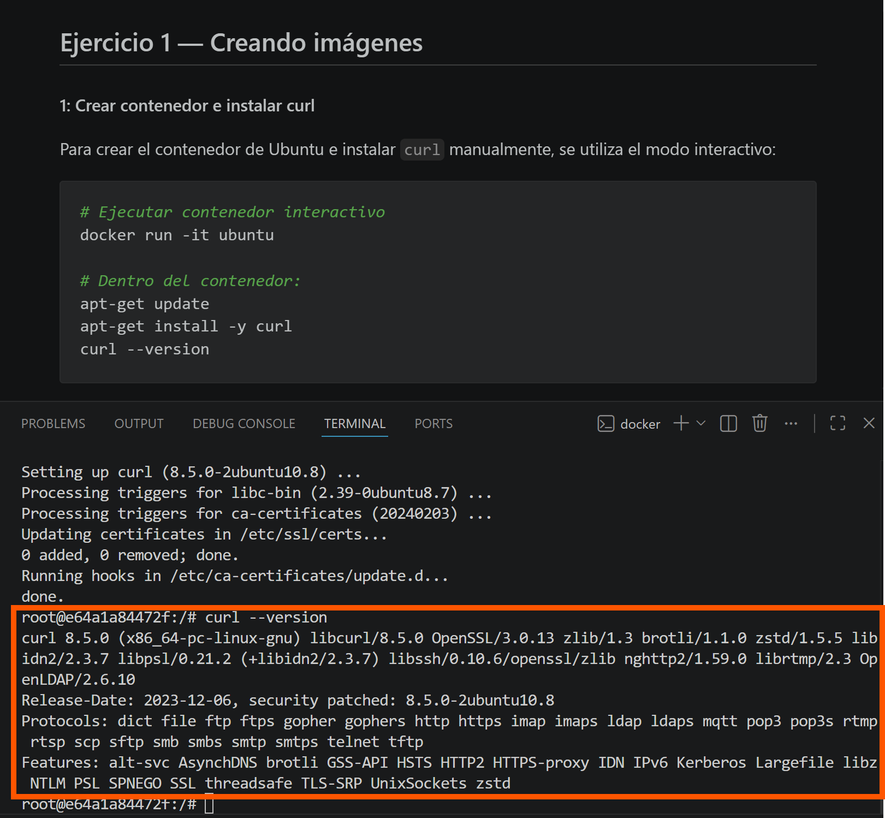
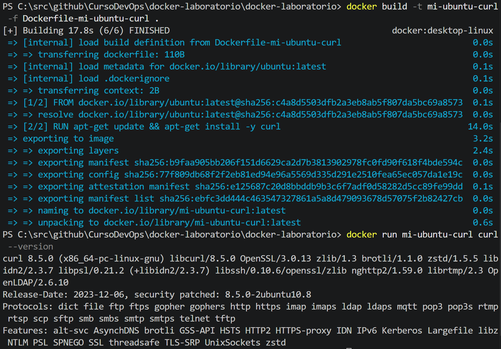
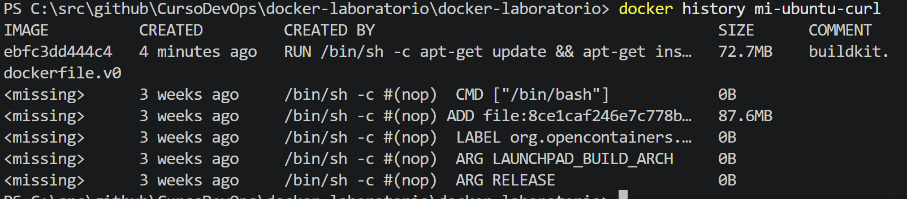
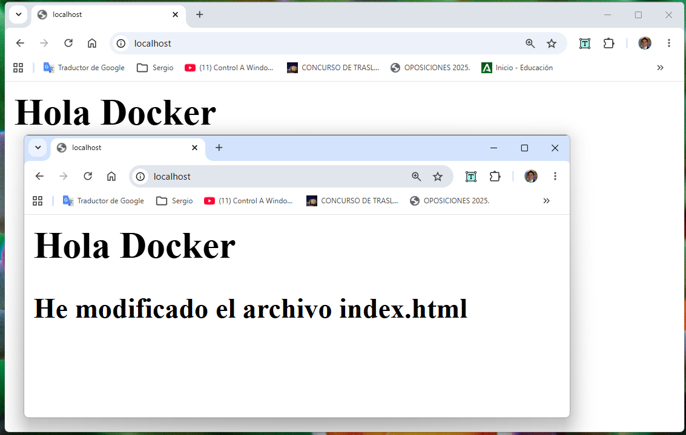
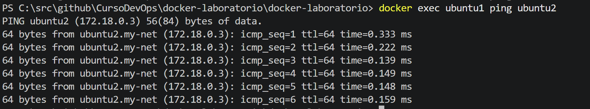
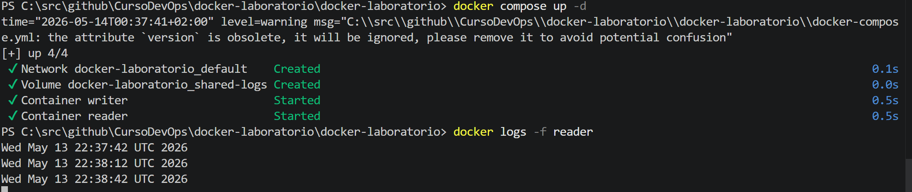

# Laboratorio Docker — Fundamentos y Gestión de Contenedores
Este documento contiene la resolución de los ejercicios del laboratorio de Docker, detallando los comandos utilizados y las evidencias de su ejecución.

**Alumno: Sergio David Muñoz Capo**  
**Curso: Introducción a DevOps**  
**Fecha: 03/05/2026**  

---

# Instrucciones

- Ejecuta cada paso.
- Realiza capturas de pantalla como evidencia.
- Responde a las preguntas en los apartados indicados.

---

## Ejercicio 1 — Creando imágenes

### Ejercicio 1.1: Crear contenedor e instalar curl

Para crear el contenedor de Ubuntu e instalar `curl` manualmente, se utiliza el modo interactivo:

```bash
# Ejecutar contenedor interactivo
docker run -it ubuntu

# Dentro del contenedor:
apt-get update
apt-get install -y curl
curl --version
```

El flag `-it` permite que la terminal acepte la entrada estándar y devuelva la salida interactiva.



### Pregunta: ¿Con qué comando podrías guardar los cambios del contenedor como una nueva imagen?
El comando es docker commit <ID_CONTENEDOR> <NOMBRE_IMAGEN>. 

```bash
docker commit <ID_CONTENEDOR> mi-ubuntu-curl
```
---

### Ejercicio 1.2: Dockerfile

Crea un Dockerfile que haga lo mismo automáticamente. Es decir, se crea un archivo llamado `Dockerfile` para automatizar el proceso:

```dockerfile
FROM ubuntu
RUN apt-get update && apt-get install -y curl
```
Para construir y ejecutar la imagen:

```bash
#utiliza el archivo Dockerfile
docker build -t mi-ubuntu-curl .
#Alternativamente no utilizas el archivo dockerfile y tiene otro nombre
docker build -t mi-ubuntu-curl -f Dockerfile-mi-ubuntu-curl .
docker run mi-ubuntu-curl curl --version
```

El comando `docker build` usa un *contexto de build* (el punto `.`) para leer los archivos necesarios.



---

### Preguntas ¿Qué comando permite ver las capas de una imagen Docker?
`docker history <nombre_imagen>`.
Las imágenes se construyen *capa a capa*, permitiendo compartirlas entre diferentes imágenes para ahorrar espacio.

---

## Ejercicio 3: Volúmenes persistentes

Para asegurar la persistencia de datos en Postgres:

```bash
# Crear contenedor con volumen
docker run -d --name mi-db -v mi-volumen-datos:/var/lib/postgresql/data postgres
```

Los volúmenes permiten que los datos sobrevivan aunque el contenedor se detenga o elimine.

### Pasos de verificación

1. Conectarse a la DB y crear la tabla `items`.
2. Insertar el registro `'item1'`.
3. Detener y eliminar el contenedor.
4. Crear uno nuevo montando el mismo volumen.


---

## Ejercicio 4: Bind mounts

Vinculación de un archivo local `index.html` al contenedor Nginx:

```bash
docker run -d -p 80:80 -v $(pwd)/index.html:/usr/share/nginx/html/index.html nginx
```

El mapeo de puertos `-p` vincula el puerto del host (máquina física) con el del contenedor.

### Pregunta

**¿Qué ocurre si modificas el archivo `index.html` en tu máquina?**
Respuesta: Los cambios se ven reflejados inmediatamente en el navegador sin reiniciar el contenedor.



---

## Ejercicio 6: Redes privadas

Creación de una red para comunicación entre contenedores:

```bash
# Crear la red
docker network create my-net

# Arrancar contenedores en la red
docker run -d --name c1 --network my-net ubuntu sleep infinity
docker run -d --name c2 --network my-net ubuntu sleep infinity

# Probar comunicación (instalar ping primero)
docker exec -it c1 apt-get update && apt-get install -y iputils-ping
docker exec c1 ping c2
```

Al usar redes personalizadas, Docker habilita el *Service Discovery* por nombre, permitiendo que un contenedor localice a otro por su nombre en lugar de su IP.



---

## Ejercicio 9: Docker Compose

Uso de `docker-compose.yml` para gestionar múltiples servicios y volúmenes compartidos:

```yaml
version: '3'
services:
  writer:
    image: ubuntu
    volumes:
      - shared-logs:/app/logs
    command: sh -c "while true; do date >> /app/logs/output.log; sleep 30; done"

  reader:
    image: ubuntu
    volumes:
      - shared-logs:/app/logs:ro
    command: sh -c "tail -f /app/logs/output.log"

volumes:
  shared-logs:
```

Docker Compose es una herramienta de orquestación que permite definir dependencias y redes aisladas para los servicios definidos.



---

## Parte Opcional y Bonus

### Ejercicios 2, 5, 7 y 8: Investigaciones opcionales

* **Limpieza (Ex 2):**
  Al reconstruir imágenes sin cambiar la etiqueta, las anteriores quedan como imágenes "huérfanas" o sin etiqueta.

* **Auditoría (Ex 5):**
  Usamos:

  ```bash
  docker volume inspect <nombre>
  ```

  para ver la ruta física en el host.

* **Red None (Ex 7):**
  Sirve para aislamiento total del contenedor sin interfaces de red externas.

* **Multi-red (Ex 8):**
  Se usa:

  ```bash
  docker network connect secure-zone <contenedor>
  ```

  para añadir una segunda red a un contenedor en ejecución.

---

### Bonus: Nginx en Docker Compose

Añadido al archivo `docker-compose.yml`:

```yaml
  nginx-bonus:
    image: nginx
    ports:
      - "8080:80"
    volumes:
      - ./index.html:/usr/share/nginx/html/index.html:ro
```


---

## Instrucciones para tu entrega

1. Copia este contenido en un archivo llamado `README.md`.
2. Crea una carpeta llamada `imagenes` en el mismo directorio.
3. Guarda las capturas con nombres como:

   * `ejercicio1_paso1.png`
   * `ejercicio1_paso2.png`
   * `ejercicio3.png`
   * etc.
4. Si cambias los nombres, actualiza las rutas en el documento.

---
