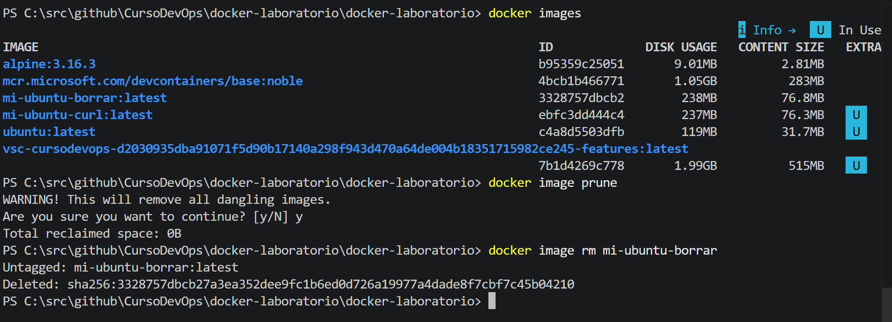
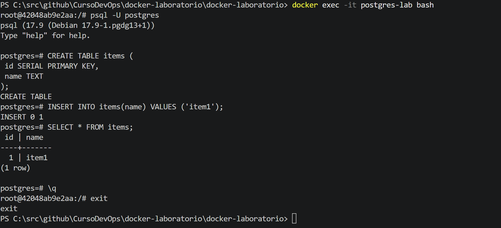
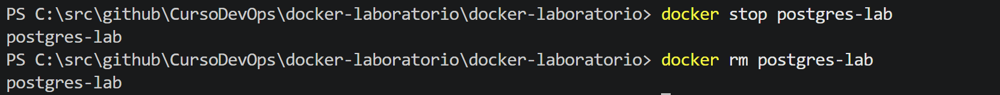
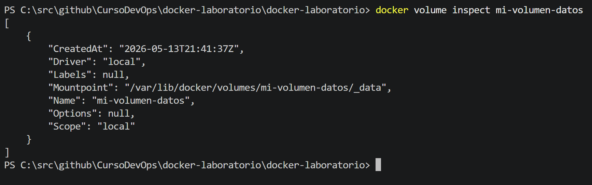
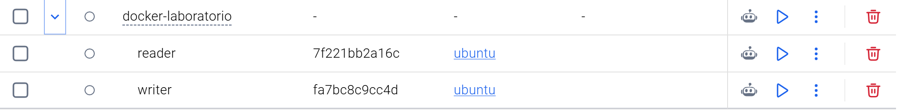

# Laboratorio Docker — Fundamentos y Gestión de Contenedores
Este documento contiene la resolución de los ejercicios del laboratorio de Docker, detallando los comandos utilizados y las evidencias de su ejecución.

**Alumno: Sergio David Muñoz Capo**  
**Curso: Introducción a DevOps**  
**Fecha: 14/05/2026**  

---

# Instrucciones

- Ejecuta cada paso.
- Realiza capturas de pantalla como evidencia.
- Responde a las preguntas en los apartados indicados.

---

## Ejercicio 1 — Creando imágenes

### Ejercicio 1.1: Crear contenedor e instalar curl

Para crear el contenedor de Ubuntu e instalar `curl` manualmente, se utiliza el modo interactivo:

```bash
# Ejecutar contenedor interactivo
docker run -it ubuntu

# Dentro del contenedor:
apt-get update
apt-get install -y curl
curl --version
```

El flag `-it` permite que la terminal acepte la entrada estándar y devuelva la salida interactiva.


### Pregunta: ¿Con qué comando podrías guardar los cambios del contenedor como una nueva imagen?
El comando es docker commit <ID_CONTENEDOR> <NOMBRE_IMAGEN>. 

```bash
docker commit <ID_CONTENEDOR> mi-ubuntu-curl
```
---

### Ejercicio 1.2: Dockerfile

Crea un Dockerfile que haga lo mismo automáticamente. Es decir, se crea un archivo llamado `Dockerfile` para automatizar el proceso:

```dockerfile
FROM ubuntu
RUN apt-get update && apt-get install -y curl
```
Para construir y ejecutar la imagen:

```bash
#utiliza el archivo Dockerfile
docker build -t mi-ubuntu-curl .
#Alternativamente no utilizas el archivo dockerfile y tiene otro nombre
docker build -t mi-ubuntu-curl -f Dockerfile-mi-ubuntu-curl .
docker run mi-ubuntu-curl curl --version
```

El comando `docker build` usa un *contexto de build* (el punto `.`) para leer los archivos necesarios.


---

### Preguntas ¿Qué comando permite ver las capas de una imagen Docker?
`docker history <nombre_imagen>`.
Las imágenes se construyen *capa a capa*, permitiendo compartirlas entre diferentes imágenes para ahorrar espacio.

---


-------------------------------------------------
# Ejercicio 2 — Limpiando imágenes (opcional)

## Dockerfile inicial

Creamos un Dockerfile: Dockerfile-mi-ubuntu-borrar basado únicamente en Ubuntu:

Añadimos curl y wget:
```dockerfile
FROM ubuntu
RUN apt-get update && apt-get install -y curl wget
```
Construimos:

```bash
docker build -t mi-ubuntu-borrar -f Dockerfile-mi-ubuntu-borrar .
```
## Listar imágenes
```bash
docker images
```

## Pregunta: ¿Qué ocurre con las imágenes anteriores?

Las imágenes anteriores permanecen almacenadas en Docker aunque ya no tengan una etiqueta asignada.

Estas imágenes siguen ocupando espacio en disco hasta que se eliminan manualmente.

Para eliminar imagenes huerfanas:
```bash
docker image prune
```
Para eliminar imagenes huerfanas:
```bash
docker image rm mi-ubuntu-borrar
```



--------------------------------------------------
## Ejercicio 3: Volúmenes persistentes

Para asegurar la persistencia de datos en Postgres:

```bash
# Crear contenedor con volumen
docker run -d --name postgres-lab -e POSTGRES_PASSWORD=1234 -v mi-volumen-datos:/var/lib/postgresql/data postgres:17
```

Los volúmenes permiten que los datos sobrevivan aunque el contenedor se detenga o elimine.

### Pasos de verificación
0. Comprobar que funciona el contenedor
1. Conectarse a la DB y crear la tabla `items`.
2. Insertar el registro `'item1'`.
```bash
# Comprobar el contenedor --> Salida Esperada: database system is ready to accept connections
docker logs postgres-lab
# Acceder al contenedor
docker exec -it postgres-lab bash
#Entrar a PostgreSQL --> postgres=#
psql -U postgres
#Crear la tabla en postgre --> CREATE TABLE
CREATE TABLE items (
 id SERIAL PRIMARY KEY,
 name TEXT
);
#Insertamos una fila 
INSERT INTO items(name) VALUES ('item1');
#Verifivamos que se ha insertado
SELECT * FROM items;
# salimos de PostgreSQL
\q
# exit bash
exit

```

3. Detener y eliminar el contenedor.
```bash
docker stop postgres-lab
docker rm postgres-lab
```



4. Crear uno nuevo montando el mismo volumen.
```bash
# Crear un nuevo contenedor usando el volumen anterior
docker run -d --name postgres-lab-2 -e POSTGRES_PASSWORD=1234 -v mi-volumen-datos:/var/lib/postgresql/data postgres:17

docker exec -it postgres-lab-2 bash
psql -U postgres
```
Para listar los volumenes creados se puede utilizar el siguiente comando.
```bash
#Listar volumen de datos
docker volume ls
```
--------------------------------------------------
## Ejercicio 4: Bind mounts

Vinculación de un archivo local `index.html` al contenedor Nginx:
```bash
docker run -d --name nginx-test -p 80:80 -v ${PWD}\index.html:/usr/share/nginx/html/index.html nginx
```
El mapeo de puertos `-p` vincula el puerto del host (máquina física) con el del contenedor.

### Pregunta
**¿Qué ocurre si modificas el archivo `index.html` en tu máquina?**
Los cambios se ven reflejados inmediatamente en el navegador sin reiniciar el contenedor.


--------------------------------------------------
## 5. Auditando volúmenes (opcional)
Investiga:
¿Qué comando permite ver dónde guarda Docker los datos de un volumen? El comando docker volume inspect <nombre_volumen>
```bash
#docker volume inspect <nombre_volumen>
docker volume inspect mi-volumen-datos
```


--------------------------------------------------
## Ejercicio 6: Redes privadas
Creación de una red para comunicación entre contenedores:

```bash
# Crear la red
docker network create my-net

# Arrancar contenedores en la red
docker run -dit --name ubuntu1 --network my-net ubuntu
docker run -dit --name ubuntu2 --network my-net ubuntu

# Probar comunicación (instalar ping primero )
docker exec -it ubuntu1 bash -c "apt update && apt install -y iputils-ping"
docker exec ubuntu1 ping ubuntu2
```

## Pregunta: ¿Los contenedores pueden comunicarse entre sí?
Sí. Los contenedores conectados a la misma red Docker personalizada pueden comunicarse entre ellos utilizando directamente el nombre del contenedor como si fuera un hostname. Docker proporciona resolución DNS interna automáticamente dentro de las redes personalizadas.


--------------------------------------------------
## Ejercicio 7: Red none (opcional)
Investiga: ¿Para qué serviría ejecutar un contenedor con red none:
  ```bash
  --network none
  ```
Sirve para aislamiento total del contenedor sin interfaces de red externas.
Uso típico

Se utiliza cuando se necesita:
- Ejecutar procesos completamente aislados por seguridad
- Evitar cualquier comunicación externa
- Realizar pruebas offline
- Ejecutar tareas internas sin riesgo de fuga de datos por red

--------------------------------------------------
## Ejercicio 8:Multi-network (opcional)
  Crea dos redes:
    + secure-zone
    + public-zone
  Se usa:

  ```bash
  docker network create secure-zone
  docker network create public-zone

  docker run -dit --name multi-test --network public-zone ubuntu
  ```

**Pregunta: ¿Puedes conectarlo también a secure-zone?**
Sí.Un contenedor puede estar conectado a varias redes al mismo tiempo en Docker  ¿Qué comando usarías?
```bash
docker network connect secure-zone multi-test
```

**Resultado**
Después de ejecutar ese comando, el contenedor estará en public-zone
y también en secure-zone, en ambas redes, y esto le permite comunicarse con contenedores en ambas redes.

------------------------------------------------
# Ejercicio 9 — Docker Compose (Compartiendo volúmenes)

## Objetivo

Crear un sistema con Docker Compose donde dos servicios compartan un volumen:
- `writer`: escribe timestamps en un fichero
- `reader`: muestra ese fichero en tiempo real

## Archivo `docker-compose.yml`

Crea un archivo llamado:

```bash
docker-compose.yml
```
Escribir en el archivo docker-compose.yml el siguiente contenido.
```yaml
version: "3.9"

services:
  writer:
    image: ubuntu
    container_name: writer
    volumes:
      - shared-logs:/app/logs
    command: >
      bash -c "while true; do date >> /app/logs/output.log; sleep 30; done"

  reader:
    image: ubuntu
    container_name: reader
    volumes:
      - shared-logs:/app/logs:ro
    command: >
      bash -c "tail -f /app/logs/output.log"

volumes:
  shared-logs:
```
**writer** --> Monta el volumen shared-logs que escribe la fecha cada 30 segundos en:/app/logs/output.log

**reader** --> Monta el mismo volumen en modo solo lectura (:ro) y Muestra en consola el contenido en tiempo real.

```bash
docker compose up -d
docker logs -f reader
```
Este ejercicio demuestra:

Uso de volúmenes compartidos en Docker Compose
Comunicación indirecta entre contenedores
Persistencia de datos entre servicios
Uso de modo solo lectura (:ro) para proteger datos
Docker Compose es una herramienta de orquestación que permite definir dependencias y redes aisladas para los servicios definidos.



--------------------------------------------------


